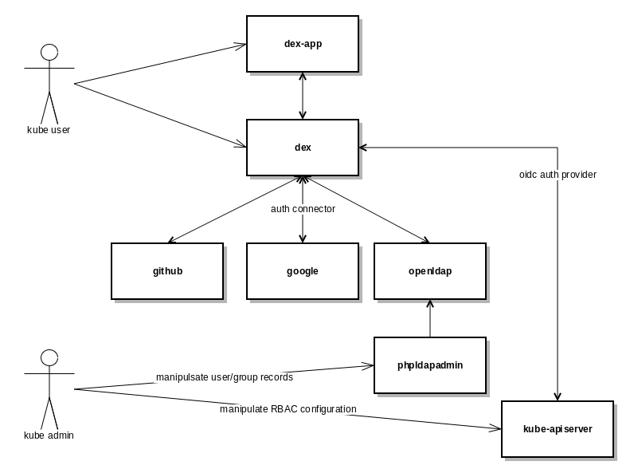
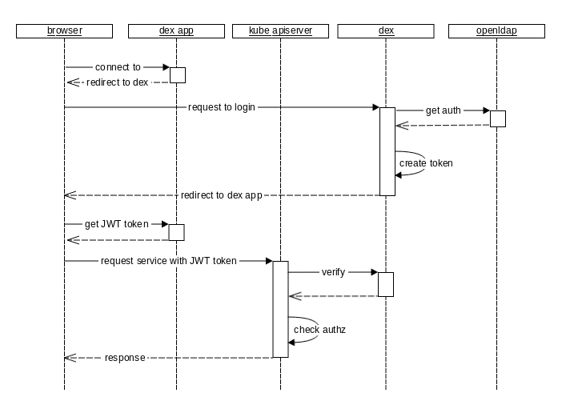
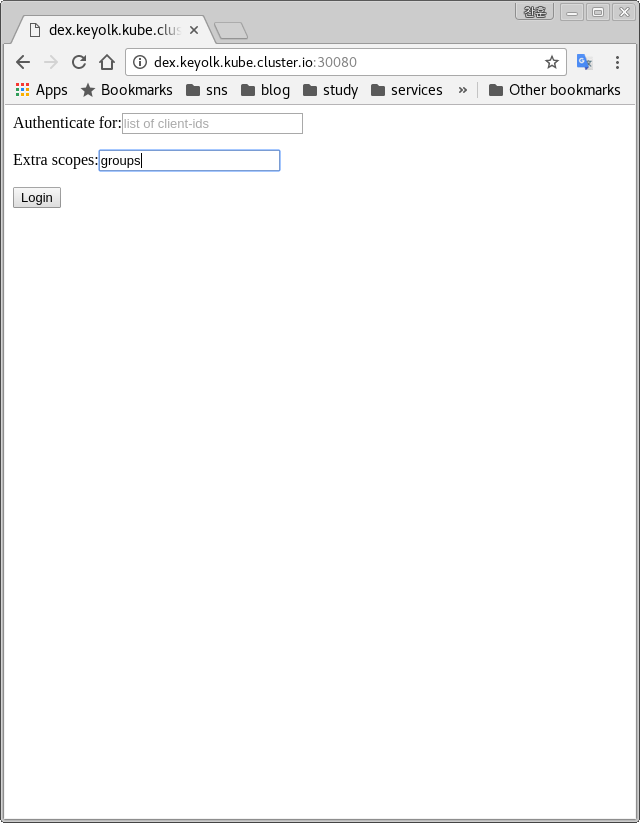
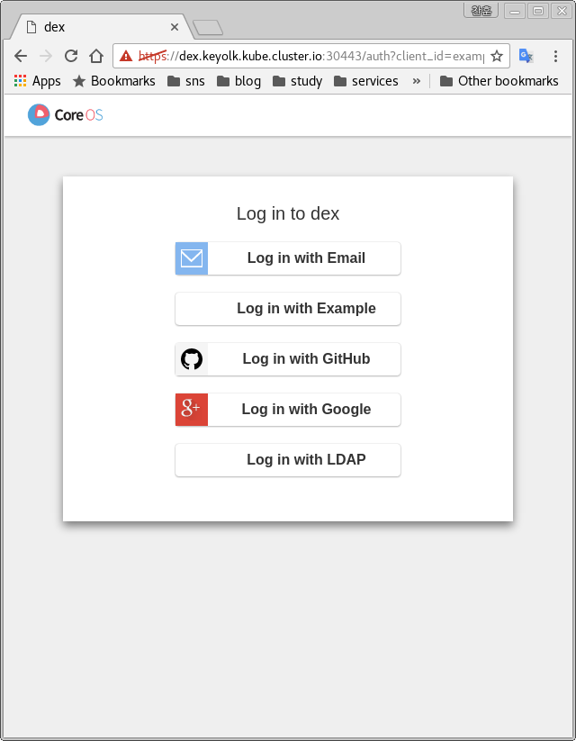
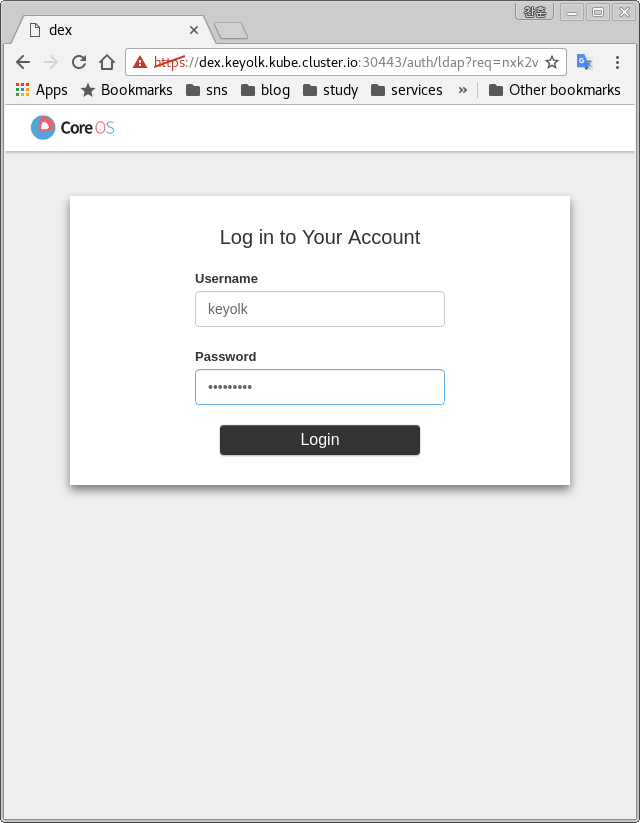
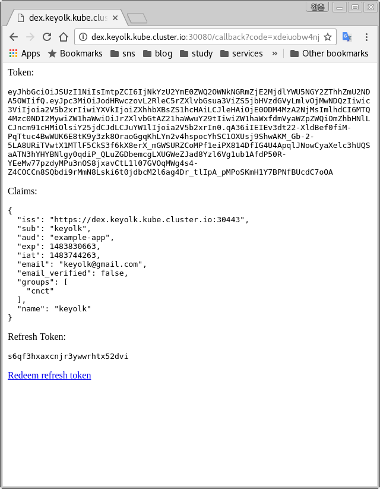

# Security in Kraken
This document describes how AuthN/Z is used in Kraken, and how to test it.

Currently it uses OIDC Authentication using CoreOS Dex.
It support following authentication backends.
- Github OAuth
- Google OIDC
- LDAP

RBAC is used for Authorization.

## Architecture
The following images are for understanding the AuthN/Z process in Kraken.


From above, dex & dex app should be accessible from browser.
The kube admin should manage user/group records in LDAP.
Also configures proper RBAC policies for each of the records.

Below is the sequence of getting/validating auth.


## Configuration
By default, Auth is disabled in Kraken.
To enable this see below example in config.yaml
```yaml
definitions:
  ...
  kubeAuth:
   - &defaultKubeAuth
    authn:
      oidc:
        service_name: dex
      default_basic_user: admin
      basic:
      - user: admin
        password: secret
        group: system:masters
    authz:
      rbac:
        super_user: admin
   - &rbacKubeAuth
      authz:
        rbac: {}
      authn:
        cert:
          -
            user: "admin"
            group: "system:masters"
        default_basic_user: "admin"

```

From above, for authentication, it uses `dex` for oidc provider. For Authorization, it uses RBAC.

The user `admin` is basic authentication user has password `secret`.
It is default user so will be set to kubeConfig file.
It is also RBAC super user, so has permission to manage RBAC policies.

Below is an example service configuration.

```yaml
helmConfigs:
  - &defaultHelm
    name: defaultHelm
    kind: helm
    repos:
      - name: atlas
        url: http://atlas.cnct.io
      - name: stable
        url: https://kubernetes-charts.storage.googleapis.com
    charts:
    - name: openldap
      repo: atlas
      chart: openldap
      version: 0.1.0
      namespace: kube-auth
      values:
        OpenLdap:
          Domain: local.io
          AdminPassword: admin
    - name: dex
      repo: atlas
      chart: dex
      version: 0.1.0
      namespace: kube-auth
      values:
        DexApp:
          RedirectUri: <Your DexApp Redirect URI, browser should be accessible on it.>
        Dex:
          Issuer: <Your Dex Issuer URI, browser should accessible on it, DexApp either.>
          Connector:
            GitHub:
              Name: "GitHub"
              ClientId: <Your Client ID>
              ClientSecret: <Your Client Secret>
            Oidc:
              Issuer: https://accounts.google.com
              ClientId: <Your Client ID>
              ClientSecret: <Your Client Secret>
            Ldap:
              Name: "LDAP"
              Host: "openldap:389"
              InsecureNoSsl: true
              InsecureSkipVerify: true
              BindDn: "cn=admin,dc=local,dc=io"
              BindPw: "admin"
              UserSearch:
                BaseDn: "ou=users,dc=local,dc=io"
                Filter: "(objectClass=posixAccount)"
                Username: "uid"
                IdAttr: "uid"
                EmailAttr: "mail"
                NameAttr: "uid"
              GroupSearch:
                BaseDn: "ou=groups,dc=local,dc=io"
                Filter: "(objectClass=posixGroup)"
                UserAttr: "uid"
                GroupAttr: "memberUid"
                NameAttr: "cn"
  readiness:
    type: exact
    value: 0
    wait: 600
        DexApp:
          RedirectUri: <Your DexApp Redirect URI, browser should be accessible on it.>
```

The chart `dex` is oidc provider for kube-apiserver.
It has two endpoints which the user should access, 'Dex' and 'DexApp'.
It should be accessible from the user side but also cluster side.

The chart `openldap` is used for authentication backend of `dex`.

## Endpoints
By default, the chart exposes ports 30443, 30080 for `dex`.
The user should use same URI which is defined in the config.yaml,
and port 31080 is also exposed for phpLDAPadmin which is included in `openldap`.

To access the service, the following ingress configuration is required.
```yaml
definitions:
  ...
  providerConfigs:
    ingressSecurity:
      -
        from_port: 30080
        to_port: 30080
        protocol: "TCP"
        cidr_blocks: ["0.0.0.0/0"]
      -
        from_port: 30443
        to_port: 30443
        protocol: "TCP"
        cidr_blocks: ["0.0.0.0/0"]
      -
        from_port: 31080
        to_port: 31080
        protocol: "TCP"
        cidr_blocks: ["0.0.0.0/0"]
```
## LDAP
Following LDAP configuration is suitable with the config.yaml defined top.
Commented line is done when openldap is deployed.
```lidf
# LDIF Export for dc=local,dc=io
# Server: localhost (localhost)
# Search Scope: sub
# Search Filter: (objectClass=*)
# Total Entries: 6
#
# Generated by phpLDAPadmin (http://phpldapadmin.sourceforge.net) on December 15, 2016 11:06 pm
# Version: 1.2.3

#version: 1

# Entry 1: dc=local,dc=io
# dn: dc=local,dc=io
# dc: local
# o: Example Inc.
# objectclass: top
# objectclass: dcObject
# objectclass: organization

# Entry 2: cn=admin,dc=local,dc=io
# dn: cn=admin,dc=local,dc=io
# cn: admin
# description: LDAP administrator
# objectclass: simpleSecurityObject
# objectclass: organizationalRole
# userpassword: admin

# Entry 3: ou=groups,dc=local,dc=io
dn: ou=groups,dc=local,dc=io
objectclass: organizationalUnit
objectclass: top
ou: groups

# Entry 4: cn=cnct,ou=groups,dc=local,dc=io
dn: cn=cnct,ou=groups,dc=local,dc=io
cn: cnct
gidnumber: 500
memberuid: <memberuid>
objectclass: posixGroup
objectclass: top

# Entry 5: ou=users,dc=local,dc=io
dn: ou=users,dc=local,dc=io
objectclass: organizationalUnit
objectclass: top
ou: users

# Entry 6: uid=<uid>,ou=users,dc=local,dc=io
dn: uid=<uid>,ou=users,dc=local,dc=io
cn: <cn>
gidnumber: 500
givenname: <name>
homedirectory: /home/<Username>
mail: <your_email>
mobile: <your_phone>
objectclass: inetOrgPerson
objectclass: top
objectclass: posixAccount
pager: cn=admin,dc=local,dc=io
sn: <sn>
uid: <uid>
uidnumber: 1000
userpassword: secret
```
It has one group with one user.

Let's see the LDAP connector configuration again.
```yaml
Ldap:
  Name: "LDAP"
  Host: "openldap:389"
  InsecureNoSsl: true
  InsecureSkipVerify: true
  BindDn: "cn=admin,dc=local,dc=io"
  BindPw: "admin"
  UserSearch:
    BaseDn: "ou=users,dc=local,dc=io"
    Filter: "(objectClass=posixAccount)"
    Username: "uid"
    IdAttr: "uid"
    EmailAttr: "mail"
    NameAttr: "uid"
  GroupSearch:
    BaseDn: "ou=groups,dc=local,dc=io"
    Filter: "(objectClass=posixGroup)"
    UserAttr: "uid"
    GroupAttr: "memberUid"
    NameAttr: "cn"
```

Parameters:
- Ldap
  - BindDn : The DN and password for an application service account.
  - BindPW: The connector uses these credentials to search for users and groups. Not required if the LDAP server provides access for anonymous auth.
  - UserSearch:
    - BaseDN: BaseDN to start the search from. It will translate to the query
    - Filter: Optional filter to apply when searching the directory.
    - Username: Attribute used for comparing user entries. This will be translated and combined with the other filter as '(<attr>=<username>)'.
    - IdAttr: String representation of the user.
    - EmailAttr: Required. Attribute to map to Email.
    - NameAttr: Maps to display name of users. No default value.
  - GroupSearch:
    - BaseDn: BaseDN to start the search from. It will translate to the query '(&(objectClass=group)(member=<user uid>))'.
    - Filter: Optional filter to apply when searching the directory.
    - UserAttr/GroupAttr: Used to match a user to a group. It adds an additional requirement to the filter that an attribute in the group must match the user's attribute value.
    - NameAttr: Represents group name.

You can confirm whether search function work or not
using below info with phpLDAPadmin.
```bash
BaseDN: ou=users,dc=local,dc=io
Filter: (&(objectClass=posixAccount)(uid=<user>))
ShowAttribute: uid, mail

DN: ou=groups,dc=local,dc=io
Filter: (&(objectClass=posixGroup)(memberUid=<user>))
ShowAttribute: cn, gidNumber, memberUid
```

From here the informations above is used by kube-apiserver with below flags.
```bash
--oidc-issuer-url=https://auth.<cluster_name>.cluster.io:30443
--oidc-client-id=example-app
--oidc-ca-file=/etc/kubernetes/ssl/ca.pem
--oidc-username-claim=email
--oidc-groups-claim=groups
--oidc-client-id=example-app
--oidc-ca-file=/etc/kubernetes/ssl/ca.pem
--oidc-username-claim=email
```

## Login
To login, access to 'DexApp' first from browser.
Here assume its URL http://auth.<cluster_name>.cluster.io:30080


Make sure here, extra scopes filed has `groups` it be used for group authentication.



Choose LDAP



  < user >/secret



The token is used here.

```bash
$ token="<token>"

$ kubectl config set-credentials dex --token=$token
$ kubectl config set-context dex --namespace=kube-auth --user=dex
$ kubectl config use-context dex

$ kubectl get node
NAME                                         STATUS                     AGE
ip-10-0-101-31.us-west-2.compute.internal    Ready                      2h
ip-10-0-126-57.us-west-2.compute.internal    Ready                      2h
ip-10-0-127-34.us-west-2.compute.internal    Ready                      2h
ip-10-0-150-133.us-west-2.compute.internal   Ready                      2h
ip-10-0-17-58.us-west-2.compute.internal     Ready                      2h
ip-10-0-177-165.us-west-2.compute.internal   Ready                      2h
ip-10-0-36-152.us-west-2.compute.internal    Ready                      2h
ip-10-0-55-64.us-west-2.compute.internal     Ready                      2h

```

To make it simple without browser you can use below script instead.
```bash
#!/bin/bash

DEX_URI=https://auth.<cluster_name>.cluster.io:30443
DEX_CLIENT_REDIRECT_URI=http://auth.<cluster_name>.cluster.io:30080/callback
DEX_CLIENT_ID=example-app
DEX_AUTH_CONNECTOR=ldap
KUBE_CONFIG=~/.kraken/<User>/admin.kubeconfig
KUBE_CLUSTER=<cluster_name>
KUBE_NAMESPACE=<namespace>
KUBE_USER=<user>

request=/auth
params="client_id=$DEX_CLIENT_ID"
params="$params redirect_uri=$DEX_CLIENT_REDIRECT_URI"
params="$params response_type=code"
params="$params scope=groups+openid+profile+email+offline_access"
params=($params)
params=`printf "%s&" "${params[@]}"`

echo -e "\nYour token request is :"
echo ${DEX_URI}${request}?${params}

api=`curl -skL ${DEX_URI}${request}?${params} \
  | grep req | grep -i $DEX_AUTH_CONNECTOR \
  | awk -F'=' -F'"' '{print $2}'`

echo -e "\nInput your login info."
read -p 'Username: ' username
read -sp 'Password: ' password

echo -e "\nYour token is : "
token=`curl -skL \
  --data "login=$username&password=$password" \
  ${DEX_URI}${api} \
  | grep "<p> Token:" \
  | awk -F'code>' '{print $2}' | cut -d '<' -f 1`

echo $token

echo -e "\nSet the token to given kubeConfig file : $KUBE_CONFIG"

kubectl --kubeconfig $KUBE_CONFIG config set-credentials $KUBE_USER --token=$token
kubectl --kubeconfig $KUBE_CONFIG config set-context $KUBE_USER --cluster=$KUBE_CLUSTER --namespace=$KUBE_NAMESPACE --user=$KUBE_USER
kubectl --kubeconfig $KUBE_CONFIG config use-context $KUBE_USER
```

Then use it like below:
```bash
$ ./login.sh

Your token request is :
https://auth.<cluster_name>.cluster.io:30443/auth?client_id=example-app&redirect_uri=http://auth.<cluster_name>.cluster.io:30080/callback&response_type=code&scope=groups+openid+profile+email+offline_access&

Input your login info.
Username:<username>
Password:
Your token is : <token>

Set the token to given kubeConfig file : /home/<user>/.kraken/<cluster_name>/admin.kubeconfig
user "dex" set.
context "dex" set.
switched to context "dex".

```

## RBAC
It should have succeeded to login, however, we don't have the proper rights to access kube-apiserver yet, you can verify this by doing the following:

```bash
$ kubectl get pod
the server does not allow access to the requested resource (get pods)
$ kubectl get svc
NAME             CLUSTER-IP      EXTERNAL-IP   PORT(S)           AGE
dex              10.36.38.132    <nodes>       443/TCP           2h
dex-app          10.32.55.77     <nodes>       80/TCP            2h
openldap         10.34.87.98     <none>        389/TCP,636/TCP   2h
openldap-admin   10.36.175.105   <nodes>       80/TCP            2h
```

We can get service info, but not pod info, because Kraken, by default, assigns the ClusterRole to be:

```yaml
---
kind: ClusterRole
apiVersion: rbac.authorization.k8s.io/v1beta1
metadata:
  name: default
rules:
  - apiGroups: [""]
    resources:
      - componentstatuses
      - events
      - endpoints
      - namespaces
      - nodes
      - persistentvolumes
      - resourcequotas
      - services
    verbs: ["get", "watch", "list"]
  - nonResourceURLs: ["*"]
    verbs: ["get", "watch", "list"]
```

To provide access rights for its namespace, create below:
```
---
kind: Namespace
apiVersion: v1
metadata:
  name: cnct
---
kind: Role
apiVersion: rbac.authorization.k8s.io/v1beta1
metadata:
  namespace: cnct
  name: cnct
rules:
  - apiGroups: ["*"]
    resources: ["*"]
    verbs: ["*"]
---
kind: RoleBinding
apiVersion: rbac.authorization.k8s.io/v1beta1
metadata:
  name: cnct
  namespace: cnct
subjects:
  - kind: Group
    name: cnct
    namespace: cnct
roleRef:
  kind: Role
  namespace: cnct
  name: cnct
  apiVersion: rbac.authorization.k8s.io/v1beta1
```

Now we can deploy to the cnct namespace.

```bash
$ kubectl run tomcat --image=tomcat --namespace=cnct
deployment "tomcat" created

$ kubectl get pod --namespace=cnct
NAME                      READY     STATUS              RESTARTS   AGE
tomcat-1609341292-8qdbm   0/1       ContainerCreating   0          7s
```

## ToDo
#### Configuration
1. Certificates
To use dex for auth, passing dex ca certificates is required.
But there is size limitation using cloud-init with AWS.
Now it just uses the same CA as the kube apiserver uses.
Need another channel for passing it from given services to each VM instances.

And to find/set dex services configuration like issuer URL.
From now Kraken just assumes that it is located under 'values.Dex.Issuer'
The path is hard coded under kraken.config. Should be changed.

2. Ingress
The services dex, dex-app need to expose their service.
Currently It uses NodePort but seems it better to change to use IngressController.
Also proper configuration also required for config.yaml.

#### Login from CLI
Currently kubectl has a feature like 'login'.
This implementation on Kraken is not convenient yet.
Need to setting JWT token to kubectl manually.
There is workaround script but not good so.
Better reimplement DexApp and create a feature to kubectl to get auth token and set it given kubeconfig.

#### Auto sync RBAC and LDAP
When new LDAP objects is registered, related user or group's RBAC resources should be created.
